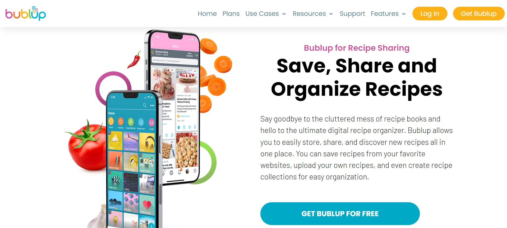
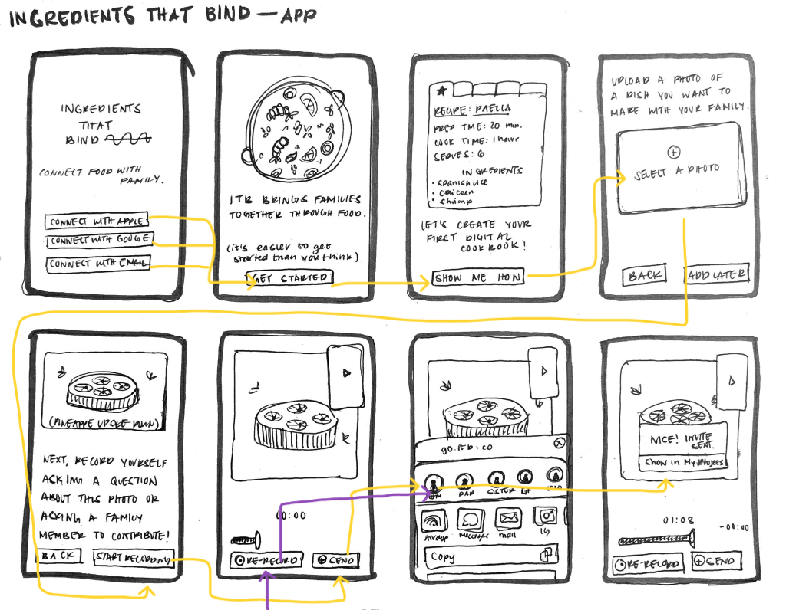
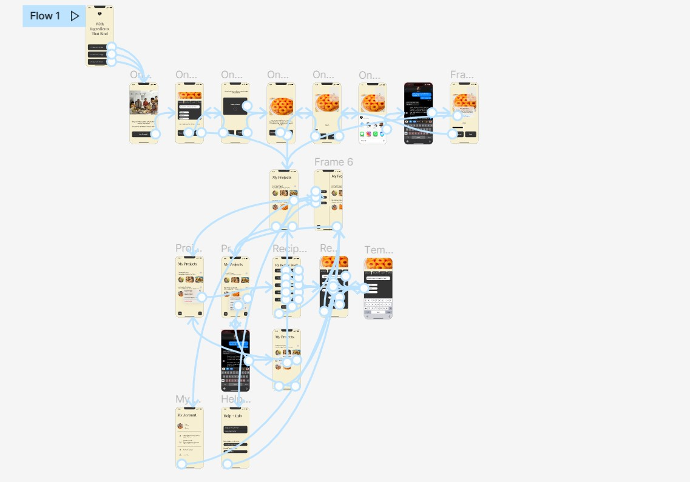

# With Ingredients that Bind 
## By Samantha Alexis Manuel 

# INTRODUCTION
With Ingredients that Bind is an app that focuses on preserving family traditions through recipe and food connections. More specifically, this project explores the capabilities of a digital cookbook or archive that helps support users to engage with their family members through memory/shared interests in food despite limitations of time and space.

# DESIGN STATEMENT 
This quarter’s design challenge is to  discover a design challenge/problem/solution regarding "connected experience" - How might we connect family with digital technology?

**Requirements:**

* The theme should be a family connection (remote or in-person) and connected experience
* Users should cover three generations (senior, mid-aged, and teen) = think how you connect with your parent or grandparent
* The target device is a "mobile" app - small screen. 

My project focuses on preserving family traditions through recipe and food connections. For many Filipinos like me, my most cherished inheritance or heirlooms are the recipes that are passed down orally in the kitchen. Whenever I cook my Filipino food, it transforms into a moment of cultural-culinary, intergenerational connection– ever-changing rituals revised by each new generation. It helps me maintain a rootedness in my own cultural ancestry while living here in America as well as a connection to my family living in the Philippines, so I was curious to see if any apps existed to help preserve or share family recipes (or the potential of creating family memories).

My project is meant to support users to engage with their parents, grandparents, or other family members through food connections and family history. I hope that through this project I can learn more about intergenerational and community connections through food– specifically intergenerational transmission and memory. I wish to understand how to engage family members in the kitchen as well as the attitudes, values, and practices towards food as an important vehicle for transmitting heritage and cultural meaning. By making these connections between family members, it could benefit to understand how a user’s memory/shared family history is provoked or embodied by food.

# COMPETITOR ANALYSIS

Currently, there are no existing products that facilitate the connection between family, food, and technology. However, there are apps that do these things separately. Remento, an app that allows you to preserve your family’s treasured memories with their conversation prompts and simple recording tools, you can consolidate your family history into a private digital library and Bublup, an app that allows you to access and share your files, but in this context, your favorite recipes from anywhere in the world. You may simply upload and digitally organize recipes with your smartphone, desktop, or tablet and you access them at any time.

The two existing projects that I tested were:

Remento 

Overall Evaluation: Overall, this app is very aesthetically pleasing to look at, intuitive to use, and its prompts help to guide meaningful conversations. More importantly, it captures sentimental features of a story– emotion, facial expression, and voice. I make minor recommendations to increase user efficiency and engagement, but it is, overall, a very thoughtful app with the option of creating your own prompts. Contentwise, very compelling and beautiful to look at.

Bublup

Overall Evaluation: Overall, Bublup, as a project management app, is helpful in that it works by saving and storing all your digital documents, specifically recipes. One of the features that Bublup offers is a way to organize and share recipes in one central location as well as archive recipes found online. Furthermore, you are able to create your own digital cookbook with a Bublup roll (aka a customized webpage). Despite being text heavy and not the most visually appealing app, it presents many capabilities and includes more personalization options (in terms of personal preference for app display) than the previous app.

You can find more information on the heuristics [here](https://github.com/samanthamanuel/DH110-Spring-2023) and usability testing [here](https://github.com/samanthamanuel/DH110-Assignment-02)

# USER RESEARCH
In terms of the target audience for this app I was looking for the following: 

*Demographic:* Users interested in food or looking to create more connections/conversations with their family. This is someone who really cares about food, loves to eat/cook. Their family places a lot of cultural value on cooking or eating together.

*Preference:* Users prefer spending their time with friends/family, they are interested in engaging with them through food (sharing/eating different recipes).

*Expertise:* No expertise in cooking or archiving is necessary for them to get started, just a genuine motivation to connect with family members.

*Mainstream vs. Extreme:* Users will be more mainstream, as in, most people have a general interest in connecting with family or a general interest in food.

For my own user research, I used qualitative research methods I employed were participatory observation and ethnographic research. My ethnographic research method involved observing my mother and sister interacting in the kitchen while cooking a family Filipino recipe. My participatory observation research included an interview with my sister who was taught the recipe by my mother, but who also fits the target demographic.  

*UX Findings:* The participant  expressed the difficulty of remembering the details of recipes because there are no measurements or set proportions— simply estimations made by taste or eye. This made the potential of a digital cookbook an appealing solution to storing and sharing recipes among other family members. Furthermore, the idea of a digital cookbook template or something resembling a cookbook in a digital format would, according to the participant, provide feelings of familiarity and trust. It was also interesting to note that the participant also spoke about the potential of sharing recipes among friends who also have a similar priority or cultural value placed on food and family. One of the most important takeaways from this project was that the participant described the ideal cookbook as having the option to record (in photo and video) the process of cooking. Even being able to add updates or new tweaks to the recipe would speak more on the process of recipes being passed down to each generation, an iterative process changing to reflect the preferences of the person cooking it themself. Overall, this session was incredibly insightful and was a useful pairing to my ethnographic research in the kitchen.

You can find more information on user research [here](https://github.com/samanthamanuel/DH110---Assignment03)

# UX STORYTELLING
UX storytelling is important for sharing experiences and explaining the values that users hold. By carefully crafting stories, you can build a better product. Good UX storytelling considers potential conflicts a user may encounter when trying to reach a specific goal and provides a possible solution through your product. Understanding how this process works can help you emotionally connect with your users and the product will be more user-centric/empathic.

**Based on my previous research, I planned to add 2 design features that I believe will allow users to better navigate a digital cookbook project:**
* Ability to add multiple collaborators to one project
* Ability to use a pre-existing template for recipe book page

Here are the two personas I developed that would address the new added design features: 

Nayeli Castro

Nayeli just recently moved into her new apartment in Westwood (after living in the dorms for a year). She’s a second year at UCLA and originally from Texas where most of her family still resides. She has been feeling a bit homesick and misses a lot of her mother’s and grandmother’s home cooking. She never really learned how to cook for herself, so she struggles with grocery store shopping and cooking sustainable meals that get her through the week. She mostly eats instant ramen and quesadillas which are not the most balanced meals. Another problem is that she’s been feeling pretty weak with low energy. She finds herself falling asleep in between classes and struggling to walk through campus— she’s concerned that her poor diet is affecting her overall health.

Alysha Macaraeg

Alysha’s dad just passed away unexpectedly due to a heart attack. She’s a chef at a famous Filipino Fusion Restaurant located in San Diego, but is currently at home taking a bereavement leave. This experience is making her think about her relationship with her family and food. Her dad supported her dream to become a chef and most of the dishes at the restaurant are inspired by her family’s recipes which were passed down to her from her parents. She also just realized, due to her busy schedule, that she hasn’t had the time to spend with her children to teach them more about Filipino recipes and their culture. 

You can find more information on UX storytelling [here](https://github.com/samanthamanuel/DH110-Assignment04)

# LOW-FIDELITY PROTOTYPE
The purpose of creating and then testing this low-fidelity prototype is to reevaluate the usability of the new features that I suggested to add to this application. It also allowed me to observe the user interact with the prototype in real-time while they communicate their thoughts aloud.

**The low-fidelity prototype I made supports the following tasks:**
* Create a New Project (YELLOW)
* Send a Request/Add Collaborators (PURPLE)
* Fill Pre-existing Template (GREEN)

Overall, the wireflow testing process went more smoothly that I expected. In fact, the individual I tested followed almost the exact same path that I outlined in the wire frame before (without any guidance).

After going through the demo, I would make the function for creating a new project a lot clearer. Although they were able to find the right path to creating a new project, I realized that they were going through more steps needed to accomplish the task. In order to avoid this issue, I would incorporate a button for creating a new project on the landing page. As for the other tasks for the project, they were able to send/request for collaborators as well as fill the pre-existing template.

Please find the voice recording of the demo session [here](https://drive.google.com/file/d/1Su5bBa2GSkHhaajA_vgjrxqJ2kMLfkke/view)

You can find more information on the low-fidelity prototype is [here](https://github.com/samanthamanuel/DH110-Assignment05)

# HIGH FIDELITY PROTOTYPE
Creating a high-fideility prototype was a culmination of all the research I conducted and feeback that I recieved through usertesting, impression testing, and prototyping. 

To view the prototype wireflow click [here](https://www.figma.com/file/4KN1fCa5r7IX7vht8ZwpEG/DH110---With-Ingredients-that-Bind?type=design&node-id=77%3A2488&t=EfLEXBEwfMzEC0Bf-1)

You can find more information on the high-fidelity prototype [here](https://github.com/samanthamanuel/DH110-Assignment07)

# FULL INTERACTIVE HIGH-FIDELITY PROTOTYPE 

<iframe style="border: 1px solid rgba(0, 0, 0, 0.1);" width="800" height="450" src="https://www.figma.com/embed?embed_host=share&url=https%3A%2F%2Fwww.figma.com%2Fproto%2F4KN1fCa5r7IX7vht8ZwpEG%2FDH110---With-Ingredients-that-Bind%3Ftype%3Ddesign%26node-id%3D77-2526%26scaling%3Dscale-down%26page-id%3D77%253A2488%26starting-point-node-id%3D77%253A2526" allowfullscreen></iframe>

# WIREFRAME + GRAPHIC DESIGN ELEMENT
Feedback from my target users through graphic design element variation and impression testing was crucial to deciding my overall design scheme and aesthetic. Doing this allowed me to integrate the most inclusive and intutive design choices. Here’s what I decided upon in order of Typeface, Color, and Spacing. 

Typeface family and size:
I ended up taking the suggestion to use Playfair Display, 45pt and 15pt. Initially, I used Urbanist because I thought it was the cleanest, most legible font. I though that no matter what the sizing was, it would be clear to read. For the most part, I wanted the page to be easy to read and click through, hence the decision to use 45pt and 15pt. Overall, Playfair Display is great for its editorial nature and brings added dimension to the idea of "archiving" recipes.

Color Scheme:
Background color: FFFFFF
Text color: 000000
Accent color: BDA3A3
The desision to use these particular colors came from the idea of matureness and approachability. I thought the accent color I chose was bright enough but muted in order to give it a more refined look. Since people of different generations would be using this app (at least college aged and above) I picked colors that would appeal most to the particular demographic rather than making it too playful and bright.

Layout grid and spacing
For the layout grid, I used 2 columns x 8 rows. I found that this, used as a general guidline, would look more organized with all the buttons in 2 neat colums. I knew that I wanted to have 10 buttons along with the optional button to add your own category, text prompt, and navigation buttons below. This layout allowed me to take into account all the elements needed to have a functional but wholistic layout that allows the users to see everything at once without the need to scroll.

You can find more information on the wireframes and graphic design element variation [here](https://github.com/samanthamanuel/DH110-Assignment06)

# EVALUATION AND REVISION HISTORY 
## Cognitive Walkthrough:
Cognitive walkthroughs are important for evaluating the usability of my app. The cognitive walkthrough was designed to see users carry out tasks or navigate the system. 

Key takeways/Things to improve on:
* Make the recipe invite clearer
* Make recordings optional, clarify how they are related to invites
* Pathway to reaching recipe types should be clearer 

You can find more information for the cognitive walkthrough [here](https://docs.google.com/document/d/1Zpj8C6t6IGGubGRGi4mSWwlTNwKSuXA5kIM8rlJI7sk/edit)

## Impression Test:
The impression test is an essential part of the design phase. I asked my participant what they remembered about the design and how they felt about it/their impressions.

Please access the screen/audio recording [here](https://drive.google.com/file/d/143ypF1aC2lKjegE4DpbdTxd4epHI94yu/view)

5 second test findings
* Overall, the interviewee preferred and remembered the pink accents, general idea of the page, and the menu features on the bottom of the screen.
* Typography: They preferred the Playfair Display font the most
* Color: Thought the light mode of the wireframe was memorable rather than the dark mode
* Shape: Liked the slighly rounded edges the most out of the 3 different shapes
* Overall, they thought there could be more ways to improve the app with more photos or icons

## Accessibility Audits:
Accessibility Audits, like the one you see below, allows us to determine whether or not a digital platform/design is reasonably accessible for users with disabilities. Running these audits allows us to identify any barriers to rectify it. As you can see, I made sure that it reaches [Level AAA](https://www.w3.org/TR/UNDERSTANDING-WCAG20/conformance.html) success criteria. 

# PITCH VIDEO

You can find the link to the pitch video [here](https://drive.google.com/file/d/1wm-IX6cSYi3JmDbO-ewwCZy6fYsbaz3S/view?usp=sharing).

# CONCLUSION

As someone with no previous experience in UX/UI design, this was the very first time I learned how to use user-centered research and design to create an app. I learned how integral UX research is as well as the time/resources it takes to carry it out properly. I suppose I never realized how often and how iterative the process of UX/UI design is and how there are always many ways to improve accessibility, enjoyment, engagement, and efficiency. One of my key takeaways is learning how to use Figma. I never thought that through this process I would be able to hone my design skills. I can already see myself using this tool in the future. 
If given the opportunity to continue this project, I would have loved to have done a more longitudinal study with more participants testing the product. This would be helpful for gathering more feedback. I would have also wished to have more time to really make my hi-fidelity prototype as realistic and smooth as possible. I thought that I would be making a brand-new app at first but through this process I learned that it takes a lot more time and research than I thought! That's okay though, because it helped me realize how the most successful and useful apps are well researched, designed, and thought out which helped me appreciate the content of this class even more. Given this, I relied on using existing apps to inspire my design and approach to creating the app. I just learned how to use Figma, but if I had the rest of the year to learn all the intricacies of this design app I would have definitely added more visual elements and an element of in-app messaging. It would have also been nice to add more examples of recipe templates or examples of how other users have customized their digital cookbooks. Cooking and family is really important to me– if I had the chance to do this project again, I would try to make it from scratch.
This course was challenging for me personally but equally rewarding. I jumped into this course without knowing much about UX/UI design and came out with a better understanding and appreciation for design that is human-centered or sparks joy. Overall, I believe that my project is a potential solution to bringing families together with food, stories, and preservation despite limitations of time, space, or age.
